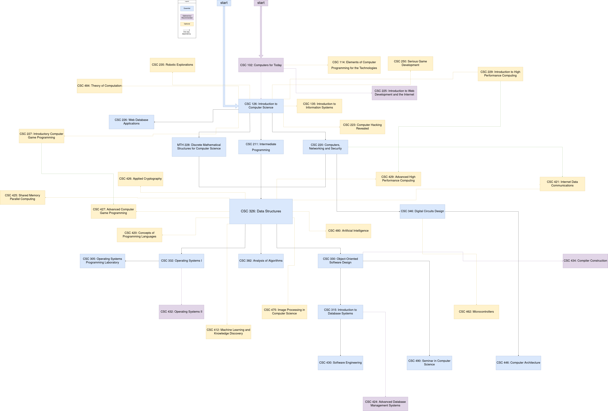

# CSI-CSC-roadmap

A Comprehensive Roadmap of CSI CSC classes.

## Roadmap Image

## How to use this Roadmap

The roadmap consists of blocks and arrows. Each block contains a class identifier, e.g. CSC 220, followed by a colon and the name of the class. Each block can have one of three colors; e.g. yellow, blue, and purple(read the legend for significance). There are two type of arrows, the start arrows, and the connection arrows. The start arrows come in two colors, e.g. blue and purple, and are only two. The connection arrows can have one of four colors; e.g. black, yellow, purple, green. The first three colors respectively, arbitrarily represent the child node's color, and signify the continuation of the course, e.g. to take CSC 382: Analysis of Algorithms you have to take CSC 326: Data Structure or CSC 326: Data Structure (black)-> CSC 382: Analysis of Algorithms. The third color, green represents a logical, BUT NOT, course related connection, e.g. It makes that if you optionally choose to take CSC 227: Introductory Computer Game Programming it makes logical sence that you take CSC 427: Advanced Computer Game Programming or CSC 227: Introductory Computer Game Programming (green)-> CSC 427: Advanced Computer Game Programming.

## Software

The software used to create these diagrams is [draw.io](https://www.draw.io/). Just open the file `CSI.drawio` and you can start editing.